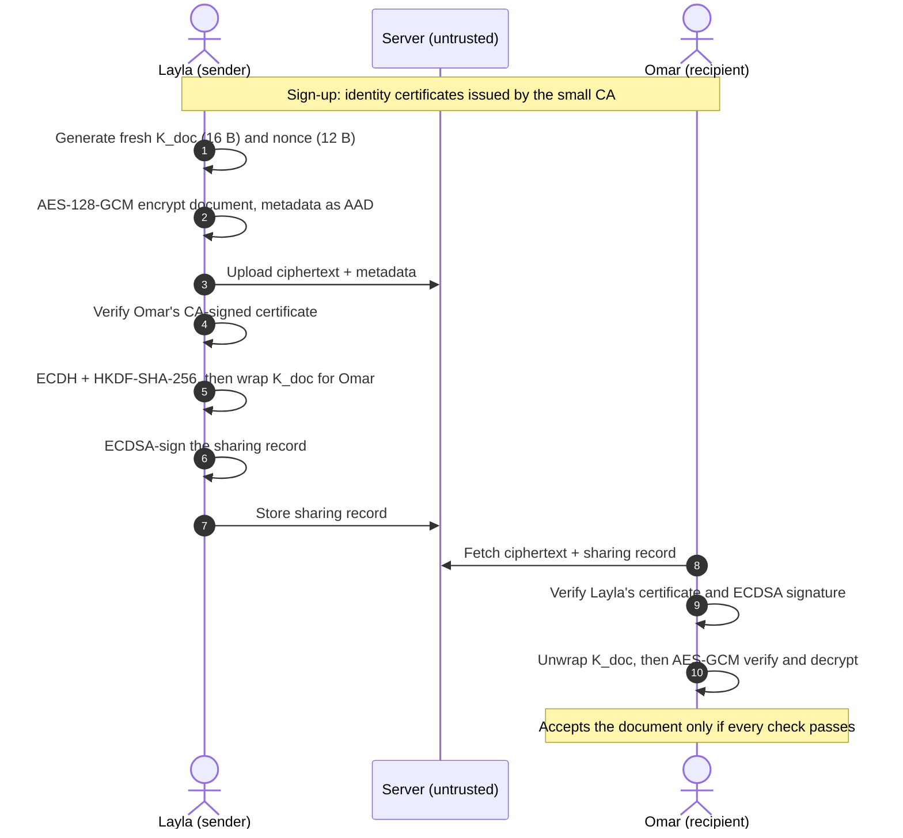

# **🔐 SecureVault**

**A multi-user encrypted document exchange system, built for a server you don't have to trust.**

ENCS4320 Applied Cryptography · Birzeit University · Term 1253 · Final Course Project

> **Status:** the core cryptographic components are implemented and tested separately. Full end-to-end integration (sign-up → upload → share → verify) is in progress. See [Project Status](#-project-status) for exactly what works today.

---

## **📑 Table of Contents**

1. [Overview](#-overview)
2. [Threat Model](#-threat-model)
3. [Design Inspiration](#-design-inspiration)
4. [How It Works](#-how-it-works)
5. [Cryptographic Components](#-cryptographic-components)
6. [Security Properties](#-security-properties)
7. [Project Status](#-project-status)
8. [Getting Started](#-getting-started)
9. [Demo Scenarios](#-demo-scenarios)
10. [Repository Structure](#-repository-structure)
11. [Limitations](#-limitations)
12. [Security Notes](#-security-notes)
13. [AI Usage](#-ai-usage)
14. [Team](#-team)

---

## **📖 Overview**

SecureVault lets users store private documents on a server and share them with other users. The server holds every byte users upload, yet it **must never be able to read any of it**.

- The client **encrypts each document before upload**.
- The server stores and relays only encrypted files, certificates, and sharing records. It never receives the plaintext document key.
- A recipient can open an authorized document, **detect any change** to the file or its metadata, and **verify who signed** the sharing record.

The scenario the system is built around:

> Layla registers, uploads `thesis-draft.pdf`, and shares it with Omar. The server sees only ciphertext and its size. Omar downloads it and his client confirms two things: the file is intact, and it came from Layla. He can prove that to a third party. If an attacker flips one ciphertext byte, edits the file name, or replays an old upload, Omar's client rejects it.

---

## **🛡️ Threat Model**

| Party | Assumptions |
|---|---|
| **Users** | Run the client on trustworthy machines. Each user's password is known only to them. |
| **Server** | *Honest-but-curious*: follows the protocol, but reads everything it is given. Its whole database may leak. |
| **Attacker** | Observes and modifies all network traffic, replays old messages, registers their own accounts, and may obtain a full copy of the server's data. |

**Out of scope:** malware on a user's machine, coercion of users, traffic analysis of message sizes and timing, and denial of service.

---

## **💡 Design Inspiration**

SecureVault is inspired by **Google's client-side encryption for Google Drive / Workspace**. Both designs encrypt files on the client with a document encryption key, and keep that key protected while the encrypted file is stored remotely.

Because the course restricts which primitives and constructions we may use, and requires us to build most of them ourselves, SecureVault is **a separate academic implementation that follows the same envelope-encryption idea in its own way**. It does not reproduce Google's protocol or all of its security properties.

| Question | Google client-side encryption | SecureVault |
|---|---|---|
| Where is the file encrypted? | On the client | On the client |
| What protects the file? | A document encryption key (DEK) | A random 16-byte document key (`K_doc`) with AES-128-GCM |
| How is the document key protected? | An external key access service (KACLS) protects the DEK | P-256 ECDH + HKDF-SHA-256 derive a key that wraps `K_doc` for each recipient |
| How are user public keys trusted? | Determined by Google's service architecture | A small CA we implement signs certificates binding usernames to public keys |

---

## **⚙️ How It Works**



**Step by step**

1. **Register and log in.** Users create accounts. Argon2id protects the stored password verifiers.
2. **Upload.** The client creates a fresh random 16-byte `K_doc` and a 12-byte nonce for each document version. AES-128-GCM encrypts the content and authenticates the encoded metadata as associated data (AAD).
3. **Share.** The sender verifies the recipient's CA-signed certificate. P-256 ECDH and HKDF-SHA-256 produce a wrapping key, and AES-GCM uses it to protect `K_doc` for that recipient.
4. **Verify and open.** The recipient verifies the sender's certificate and the ECDSA signature on the sharing record, unwraps `K_doc`, and accepts the document only after AES-GCM verification succeeds.
5. **Reject replay.** A signed version counter with persistent client state rejects an older document version *(planned)*.

Metadata that stays visible to the server (for example stored file size) must be covered by the appropriate authenticated record. The server may still learn permitted information such as ciphertext size and upload time.

---

## **🧩 Cryptographic Components**

| Component | Purpose |
|---|---|
| **AES-128-GCM** | Encrypts document contents and detects changes to ciphertext and authenticated metadata |
| **`K_doc`** | Fresh random 16-byte key for each document version |
| **P-256 ECDH + HKDF-SHA-256** | Derives a recipient-specific key for wrapping `K_doc` |
| **P-256 ECDSA** | Signs records so recipients can verify (and prove) who signed |
| **Small certificate authority** | Binds a username to its ECDH and ECDSA public keys, so a malicious server cannot substitute keys |
| **Argon2id** | Slows offline guessing against stored password verifiers |
| **Signed version counter** | Rejects stale documents when connected to persistent state |

> **MAC vs. signature:** the GCM tag proves integrity only to people who hold the secret document key. Because a shared-key tag could have been produced by either party, it **cannot provide non-repudiation**. The separate ECDSA signature is what lets a recipient show a third party who signed a record.

### **From-scratch vs. library**

The course requires at least 70% of the cryptographic algorithms to be written by the team, with any library use declared and justified.

| Component | Implemented by | Notes |
|---|---|---|
| AES-128-GCM | `TODO: team / library` | The current reference component uses PyCryptodome |
| SHA-256 / HMAC-SHA-256 / HKDF | `TODO` | |
| P-256 ECC, ECDH, ECDSA | `TODO` | |
| Argon2id | `TODO` | |
| CA and certificates | `TODO` | |

Big-integer arithmetic, OS randomness, networking and storage come from libraries and do not count against the fraction.

---

## **✅ Security Properties**

| Property | Mechanism | Status |
|---|---|---|
| Confidentiality | Client-side AES-128-GCM; `K_doc` never sent in the clear | Component implemented |
| Integrity | GCM authentication tag over ciphertext | Component implemented |
| Metadata binding | Encoded metadata authenticated as GCM AAD | Component implemented; integration tests in progress |
| Data-origin authentication | CA-signed certificate + ECDSA signature on the sharing record | To be integrated |
| Non-repudiation | ECDSA signature (not the GCM tag) | To be integrated |
| Credential protection | Argon2id with per-user salt | To be integrated |
| Freshness | Signed version counter + persistent client state | To be integrated |

---

## **📊 Project Status**

| Work | Status |
|---|---|
| AES-GCM document protection and metadata AAD | Implemented as separate components; integration tests are being assembled |
| SHA-256, HMAC-SHA-256, HKDF, P-256 ECC/ECDH/ECDSA | Implemented as separate components; run the test suite to verify current results |
| Document-key wrapping and CA certificates | Implemented as separate components; full protocol integration remains |
| Signed sharing record and upload-to-download flow | 🔄 To be integrated |
| Replay state that survives restarts | 🔄 To be integrated |
| Account workflow and private-key protection at rest | 🔄 To be integrated |
| Revocation for future versions by key rotation and re-encryption | 🗓️ Planned extension |

> ⚠️ *Update this table to match the actual committed code before presenting.*

---

## **🚀 Getting Started**

**Requirements:** Python 3.10 or newer.

```bash
# 1. Clone
git clone <YOUR-REPO-URL>
cd <YOUR-REPO-FOLDER>

# 2. Install dependencies
python -m pip install -r requirements.txt
```

> On Windows, if `python` reports a missing module, try `py` instead. Some systems have more than one Python installed, and `py` selects the right one.

**Run the tests**

```bash
python -m pytest -q
```

**Run the system**

```bash
# TODO: exact commands once the client workflow is connected, for example:
# python server.py
# python client.py
```

**Generating keys:** private keys and passwords are generated locally and never committed. `TODO: document the exact key-generation command.`

---

## **🎬 Demo Scenarios**

The demonstration covers each of the following:

- [ ] Two users register and log in on separate machines or directories
- [ ] The stored credential record reveals nothing useful about either password
- [ ] A user uploads a document; the server's stored copy is unreadable
- [ ] The document is shared with the second user, who downloads and opens it
- [ ] The recipient's client states who produced the document
- [ ] A single altered ciphertext byte is rejected cleanly
- [ ] An altered metadata field is rejected cleanly
- [ ] A replayed old object is rejected as stale
- [ ] Every implemented primitive is shown to produce correct results

`TODO: add the exact command for each scenario.`

---

## **📁 Repository Structure**

```text
TODO: replace with the real layout, for example:
.
├── src/          # client, server, and crypto primitives
├── tests/        # test suite for every primitive
├── docs/         # design report and slides
├── requirements.txt
└── README.md
```

---
## System Overview

The following diagram illustrates the document protection
process, including metadata validation, AES-GCM encryption,
binary serialization, and document verification.


## **⚠️ Limitations**

We state these honestly rather than claim unconditional security.

- The server can still learn ciphertext size and upload time.
- A user who already saved an old document key or plaintext cannot be made to forget it. Revocation only restricts access to **future** versions, by issuing a new key and re-encrypting the document.
- Replay protection depends on persistent client state; without it, an older version cannot be detected as stale.
- Users with weak or common-wordlist passwords remain exposed to offline guessing even with Argon2id.
- Out-of-scope threats (see [Threat Model](#-threat-model)) are not defended against.

---

## **🔒 Security Notes**

Private keys, passwords, plaintext document keys, and wrapping keys **must stay outside the repository**. Generate them locally, and never commit or print them.

---

## **🤖 AI Usage**

AI assistance was used for the wording and structure of this README, as permitted by the course policy. The cryptographic design, the choices of Section 7 of the project specification, and the code are the team's own work. The full AI usage statement is in the design report.

---

## **👥 Team**

| Name | Student ID | GitHub |
|---|---|---|
| `Mayar Etawi` | `1230501` | `TODO` |
| `Dalay Ghazal` | ` 1232090` | `TODO` |
| `Aya Jararaa` | `1230069` | `TODO` |

**Deliverables:** [Design report](TODO) · [Presentation slides](TODO)

