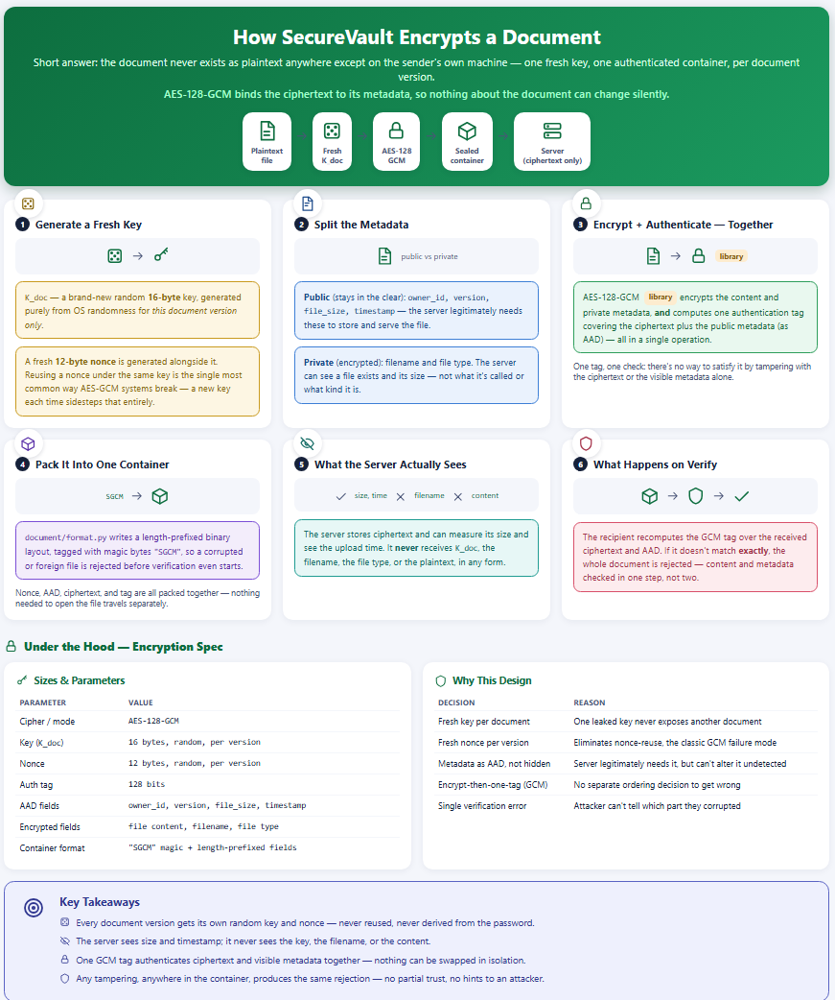
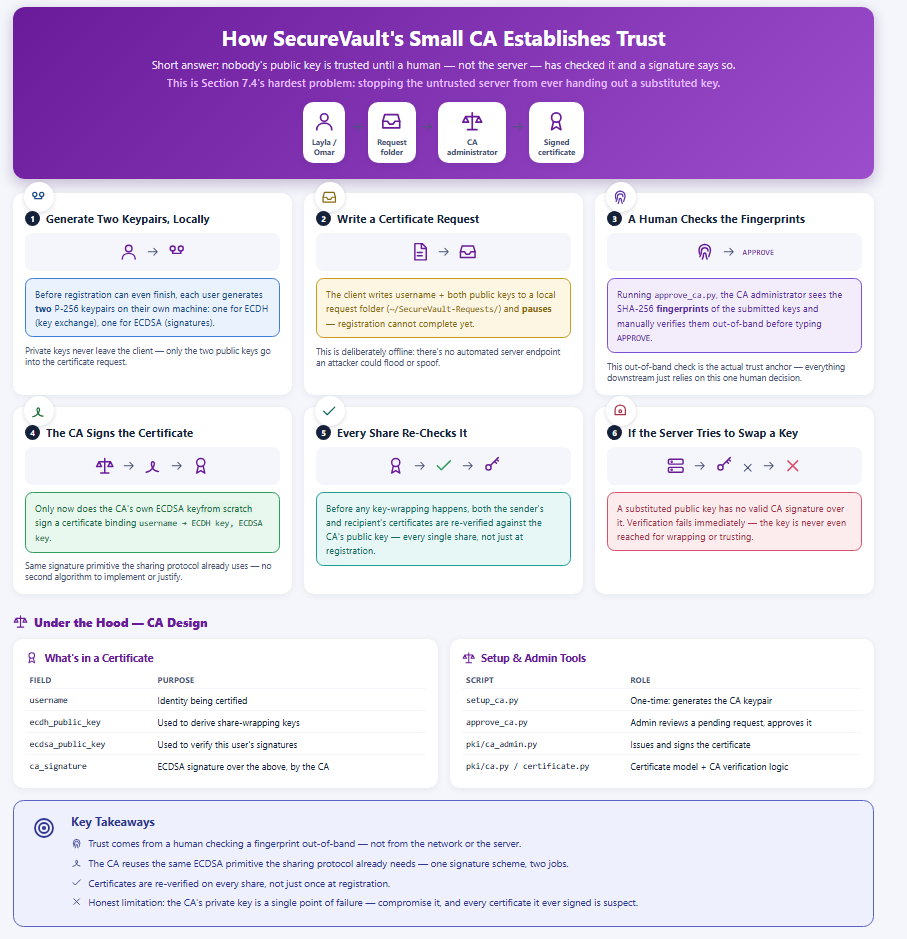

# 🔐 SecureVault

A multi-user encrypted document exchange system, built for a server you don't have to trust.

**ENCS4320 Applied Cryptography · Birzeit University · Term 1253 · Final Course Project**

**Status:** The full system is wired end to end — sign-up, login, key management, upload, share, and verify all work through the CLI menu (`main.py`) against a real socket server. See **Project Status** and **Known Issues** for exactly what works today and what still needs attention before the presentation.

---

## 📑 Table of Contents

- [Overview](#-overview)
- [Visual Guides](#-visual-guides)
- [Threat Model](#-threat-model)
- [Design Inspiration](#-design-inspiration)
- [How It Works](#-how-it-works)
- [Cryptographic Components](#-cryptographic-components)
- [Security Properties](#-security-properties)
- [Project Status](#-project-status)
- [Known Issues](#-known-issues)
- [Getting Started](#-getting-started)
- [Demo Scenarios](#-demo-scenarios)
- [Repository Structure](#-repository-structure)
- [Limitations](#-limitations)
- [Security Notes](#-security-notes)
- [AI Usage](#-ai-usage)
- [Team](#-team)

---

## 📖 Overview

SecureVault lets users store private documents on a server and share them with other users. The server holds every byte users upload, yet it never learns the plaintext.

- The client encrypts each document before upload.
- The server (`server/server.py`) stores and relays only encrypted files, certificates, and sharing records over a length-prefixed socket protocol. It never receives a plaintext document key.
- A recipient can open an authorized document, detect any change to the file or its metadata, and verify who signed the sharing record.

### Scenario Example
Layla registers, uploads `thesis-draft.pdf`, and shares it with Omar. The server sees only ciphertext and its size. Omar downloads it and his client confirms two things: the file is intact, and it came from Layla. He can prove that to a third party. If an attacker flips one ciphertext byte, edits the file name, or replays an old upload, Omar's client rejects it.

---

## 🖼️ Visual Guides

Two reference diagrams for the report and the presentation — click either image to see it full-size in the repository.

### How SecureVault Encrypts a Document
Fresh key generation, the public/private metadata split, AES-128-GCM, and what the server actually sees.



---

### How the Small CA Establishes Trust
Key generation, the offline certificate request, the human fingerprint check, and how a substituted key gets rejected.



> **Note:** Save your diagram images as `encryption_diagram.png` and `ca_diagram.png` inside the `docs/` directory of your repo so GitHub renders them cleanly.
>
> A third, auto-generated diagram of the full upload → share → verify pipeline (built from the actual module names in this repo, not hand-drawn) lives separately at `docs/securevault_pipeline.svg` and can be regenerated any time the code changes by running `python generate_diagram.py`.

---

## 🛡️ Threat Model

| Party | Assumptions |
| :--- | :--- |
| **Users** | Run the client on trustworthy machines. Each user's password is known only to them. |
| **Server** | **Honest-but-curious**: follows the protocol, but reads everything it is given. Its whole database may leak. |
| **Attacker** | Observes and modifies all network traffic, replays old messages, registers their own accounts, and may obtain a full copy of the server's data. |
| **Out of scope** | Malware on a user's machine, coercion of users, traffic analysis of message sizes and timing, and denial of service. |

---

## 💡 Design Inspiration

SecureVault is inspired by Google's client-side encryption for Google Drive / Workspace. Both designs encrypt files on the client with a document encryption key, and keep that key protected while the encrypted file is stored remotely.

Because the course restricts which primitives and constructions we may use, and requires us to build most of them ourselves, SecureVault is a separate academic implementation that follows the same envelope-encryption idea in its own way. It does not reproduce Google's protocol or all of its security properties.

| Question | Google Client-Side Encryption | SecureVault |
| :--- | :--- | :--- |
| **Where is the file encrypted?** | On the client | On the client |
| **What protects the file?** | A document encryption key (DEK) | A random 16-byte document key ($K_{\text{doc}}$) with AES-128-GCM |
| **How is the document key protected?** | An external key access service (KACLS) protects the DEK | Ephemeral P-256 ECDH + HKDF-SHA-256 derive a key that wraps $K_{\text{doc}}$ for each recipient |
| **How are user public keys trusted?** | Determined by Google's service architecture | A small offline CA we implement signs certificates binding usernames to public keys |

---

## ⚙️ How It Works

1. **Register:** The user picks a username and a password of at least 15 characters. `auth/Register.py` hashes the password with Argon2id, generates a separate P-256 keypair for ECDH and one for ECDSA, and wraps each private key with a password-derived AES-128-GCM key (`auth/private_key_protection.py`) so nothing but the password can unlock them. The public keys are then submitted for a certificate (see Certificates below), and the whole credential record — Argon2id record, wrapped private keys, and certificate — is sent to the server and stored under the username.
2. **Log in:** `auth/Login.py` fetches the stored record and re-runs Argon2id to check the password. An unknown username still runs Argon2id against a fixed dummy record (`DUMMY_PASSWORD_RECORD`) before returning failure, so a failed login takes the same shape and roughly the same time whether or not the account exists. On success, `login_and_unlock` also recovers both private keys for the session.
3. **Certificates (the small CA):** SecureVault's CA is deliberately offline and manual, not an automated server. During registration, the client writes a certificate request (username + both public keys) to a local request folder and pauses; a separate CA-administrator script (`approve_ca.py`, backed by `pki/ca_admin.py`) picks up the newest request, prints the SHA-256 fingerprints of the submitted keys, and asks a human operator to type `APPROVE` after checking them out of band. Only then does the CA sign a certificate binding the username to both public keys with its own ECDSA key. This is what stops the untrusted server from ever substituting a key during sharing (Section 7.4 of the spec).
4. **Upload:** `client/upload.py` calls `document/protect.py`, which generates a fresh random 16-byte $K_{\text{doc}}$ and a fresh 12-byte nonce for that document version, AES-128-GCM-encrypts the file content and the private metadata (filename, file type), and authenticates the public metadata (`document_id`, `owner_id`, `version`, `file_size`, `timestamp`) as GCM associated data. Everything is packed into a length-prefixed binary container (`document/format.py`, magic bytes `SGCM`) before it goes to the server. $K_{\text{doc}}$ never leaves the client.
5. **Share:** `client/share.py` and `crypto/sharing.py` first verify both the sender's and the recipient's certificates against the trusted CA public key. An ephemeral P-256 ECDH exchange plus HKDF-SHA-256 (`crypto/key_wrap.py`) derives a one-time key that wraps $K_{\text{doc}}$ with AES-128-GCM for that specific recipient. The sender then signs the entire share record — wrapped key, document ID, recipient, version — with their own long-term ECDSA key. This signature, not the GCM tag, is what gives non-repudiation: only the sender's private key could have produced it.
6. **Retrieve and verify:** `client/receive_share.py` re-verifies the sender's certificate, checks the ECDSA signature on the share record, unwraps $K_{\text{doc}}$, and only then calls `document/verify.py`, which checks the GCM tag before returning any plaintext. If anything fails, the client raises the same `DocumentVerificationError` regardless of which check failed, so a network attacker can't learn which part of the object they corrupted.
7. **Reject replay:** Each verified share carries a version number. `crypto/freshness.py` enforces "strictly newer than anything seen before" in memory during a session, and `client/version_store.py` persists the highest version seen per document to a local JSON file (`client/trusted_versions.json`) so an old, previously-valid object is still rejected as stale even after the client restarts.

Metadata that stays visible to the server (for example stored file size) is bound into the same authenticated record, so the server can see it but cannot change it without detection.

---

## 🧩 Cryptographic Components

| Component | Purpose |
| :--- | :--- |
| **AES-128-GCM** | Encrypts document contents and detects changes to ciphertext and authenticated metadata |
| **$K_{\text{doc}}$** | Fresh random 16-byte key for each document version |
| **P-256 ECDH + HKDF-SHA-256** | Derives a recipient-specific key for wrapping $K_{\text{doc}}$ |
| **P-256 ECDSA** | Signs certificates and share records so recipients can verify — and prove — who signed |
| **Small offline CA** | Binds a username to its ECDH and ECDSA public keys under a human-approved, out-of-band check, so a malicious server cannot substitute keys |
| **Argon2id** | Slows offline guessing against stored password verifiers, and also protects each private key at rest |
| **Persistent version tracker** | Rejects stale/replayed documents, backed by a per-client JSON store that survives restarts |

> **MAC vs. Signature:** The GCM tag proves integrity only to people who hold the secret document key. Because a shared-key tag could have been produced by either party, it cannot provide non-repudiation. The separate ECDSA signature is what lets a recipient show a third party who signed a record.

### From-Scratch vs. Library
The course requires at least 70% of the cryptographic algorithms to be written by the team, with any library use declared and justified.

| Component | Implemented by | Notes |
| :--- | :--- | :--- |
| **P-256 point arithmetic** (`crypto/ecc.py`) | Team, from scratch | Constant-time Montgomery-ladder scalar multiplication; no cryptographic library imports |
| **ECDH** (`crypto/ecdh.py`) | Team, from scratch | Built directly on our own `ecc.py` |
| **ECDSA** (`crypto/ecdsa.py`) | Team, from scratch | Built on our own `ecc.py`; uses Python's standard-library `hashlib.sha256` for the message digest rather than our own SHA-256 — worth calling out and, ideally, switching to our own implementation before submission |
| **SHA-256** (`crypto/sha256.py`) | Team, from scratch | Used internally by our HMAC implementation |
| **HMAC-SHA-256** (`crypto/hmac_sha256.py`) | Team, from scratch | Built on our own SHA-256 |
| **HKDF-SHA-256** (`crypto/hkdf.py`) | Team, from scratch | Built on our own HMAC-SHA-256 |
| **Small CA / certificates** (`pki/`) | Team, from scratch | Built on our own ECDSA |
| **AES-128-GCM** (`crypto/gcm.py`) | Library (PyCryptodome) | Declared library use — see Known Issues; a from-scratch AES-128 block cipher exists in `crypto/aes128.py` but is not currently wired into the GCM path |
| **Argon2id** (`auth/password_protection.py`, `auth/private_key_protection.py`) | Library (`argon2-cffi`) | Declared library use — implementing Argon2id itself is disproportionate to what the course asks for |

*Big-integer arithmetic, OS randomness, networking, and storage come from the standard library and do not count against the from-scratch fraction.*

---

## ✅ Security Properties

| Property | Mechanism | Status |
| :--- | :--- | :--- |
| **Confidentiality** | Client-side AES-128-GCM; $K_{\text{doc}}$ never sent in the clear | Implemented and integrated |
| **Integrity** | GCM authentication tag over ciphertext | Implemented and integrated |
| **Metadata binding** | Public metadata authenticated as GCM AAD; private metadata encrypted | Implemented and integrated |
| **Data-origin authentication** | CA-signed certificate + ECDSA signature on the sharing record | Implemented and integrated |
| **Non-repudiation** | ECDSA signature (not the GCM tag) | Implemented and integrated |
| **Credential protection** | Argon2id with per-user salt; unknown-username logins still run Argon2id | Implemented and integrated |
| **Freshness** | Version tracker with persistent, per-client JSON state | Implemented and integrated |

---

## 📊 Project Status

| Work | Status |
| :--- | :--- |
| **AES-GCM document protection and metadata AAD** | ✅ Implemented and covered by tests |
| **SHA-256, HMAC-SHA-256, HKDF, P-256 ECC/ECDH/ECDSA** | ✅ Implemented and covered by tests |
| **Document-key wrapping and CA certificates** | ✅ Implemented and covered by tests |
| **Signed sharing record and upload-to-download flow** | ✅ Implemented and covered by tests; end-to-end run confirmed through the CLI |
| **Replay state that survives restarts** | ✅ Implemented (`client/trusted_versions.json`) |
| **Account workflow and private-key protection at rest** | ✅ Implemented |
| **Revocation for future versions by key rotation and re-encryption** | 🗓️ Planned extension, not started |

---

## 🐞 Known Issues

Found while preparing this README — worth fixing, or at minimum being ready to explain, before the presentation:

1. **One test file cannot be collected:** `tests/test_document_gcm.py` imports from a module named `documents`, but the package is actually named `document` (singular). Running `pytest` reports a collection error for this file until the import is corrected.
2. **Three tests in `tests/test_ca_integration.py` fail against the current code:** They call `create_share(..., expected_recipient_username=...)`, but the current `create_share` signature in `crypto/sharing.py` no longer accepts that keyword argument. This looks like the test file is out of sync with a signature change in `sharing.py` rather than a real security gap — but it should be reconciled (either update the tests or restore the parameter) before claiming the sharing module is fully verified. With these three excluded, the rest of the suite passes: 212 passed, 1 skipped.
3. **Unused from-scratch AES:** The from-scratch AES-128 block cipher (`crypto/aes128.py`) is not used anywhere. The actual document encryption path (`crypto/gcm.py`) uses PyCryptodome's AES-GCM. If the from-scratch percentage is tight, this module either needs to be wired into the real GCM path or dropped from the from-scratch count so the report's numbers stay honest.
4. **Serialization security:** The socket protocol serializes requests and responses with `pickle`. `pickle.loads` on attacker-controlled bytes is a known code-execution risk in general. The current threat model assumes a passive-to-active network attacker but trustworthy endpoints, so this is a real but bounded gap — it's already noted by the team in `Caandsharing_README.md` as needing "a safe encoding ... before deployment." Worth a line in the report's Limitations section either way.
5. **In-memory server storage:** Server storage is in-memory only (`server/storage.py` uses plain Python dicts). Restarting the server loses every account, document, and share record. Fine for a demo, but should be stated explicitly as a limitation rather than discovered live.

---

## 🚀 Getting Started

**Requirements:** Python 3.10 or newer.

```bash
# 1. Clone
git clone <YOUR-REPO-URL>
cd <YOUR-REPO-FOLDER>/SecureVault

# 2. Install dependencies
# (no requirements.txt is committed yet — install these packages directly)
python -m pip install pycryptodome argon2-cffi pytest
