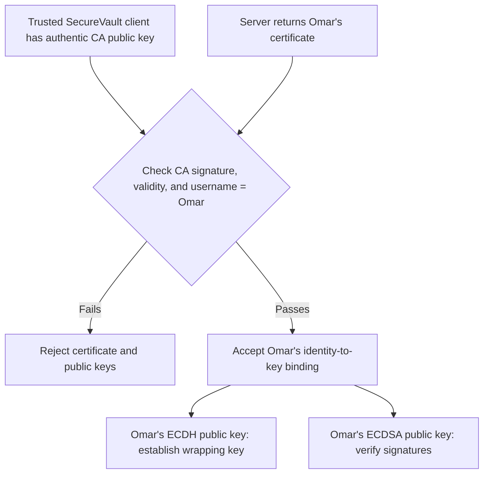

## Section 7.1

We selected Argon2id for password protection because it requires both memory and computation time, making large-scale password guessing attacks using GPUs more expensive. We did not choose PBKDF2 because it mainly increases computational work without requiring significant memory. We also did not choose bcrypt because of its limited memory usage and password-length restrictions. Although scrypt is also secure, Argon2id provides clearer and more flexible control over memory cost, time cost, and parallelism. We will select the final parameters after running benchmarks on our system, and a unique random salt will be generated for every user.

We benchmarked three Argon2id parameter sets on our test machine. The measured average execution times were 41.79 ms for 32 MiB with a time cost of 2, 119.42 ms for 64 MiB with a time cost of 3, and 254.86 ms for 128 MiB with a time cost of 3. We selected a memory cost of 128 MiB, a time cost of 3, and parallelism of 1 because it was the strongest tested configuration while maintaining an acceptable login delay of approximately 0.3 seconds. We use a 16-byte random salt and produce a 32-byte password hash.

We selected AES-128-GCM for document protection. Each upload receives a fresh 16-byte document key (Kdoc) generated with the operating system CSPRNG. AES-GCM provides confidentiality and integrity in one authenticated-encryption operation, using a 12-byte nonce and a 16-byte authentication tag.

Public document metadata, including the filename, is encoded deterministically and authenticated as GCM associated data (AAD). The authenticated context includes the record header and ciphertext length, so changes to authenticated metadata or ciphertext cause verification to fail before plaintext is returned. The file type and document contents are encrypted.

The final implementation therefore does not use the earlier AES-CTR plus HMAC Encrypt-then-MAC design for document protection. Authentication is provided by the AES-GCM tag, and the client releases plaintext only after successful GCM verification.

HKDF-SHA-256 is used in the sharing path rather than to split a document master key into separate encryption and MAC keys. After ECDH produces a shared secret, HKDF-SHA-256 derives a separate 16-byte AES-GCM wrapping key using a fresh public salt and a context bound to the sharing operation.

We selected P-256 ECDH for document-key sharing. Each user has a long-term certified ECDH public key, while each wrapping operation generates a fresh ephemeral P-256 ECDH key pair. The ECDH shared secret is processed through HKDF-SHA-256 before use; it is never used directly as an AES key.

We selected P-256 ECDSA for digital signatures. ECDSA is used with a key pair separate from ECDH. In the final sharing protocol, the sender signs the canonical ShareRecord, allowing the recipient to authenticate the sender and detect modification of the signed sharing fields.

We selected a small Certificate Authority (CA) to authenticate public keys. A CA-signed certificate binds a SecureVault username to separate P-256 ECDH and ECDSA public keys, together with certificate-format, serial-number, issuer, and validity information. The client verifies the CA signature before trusting either public key.

Replay protection for authenticated sharing records is version-based. A ShareRecord contains a document identifier and positive version number, and the version is covered by the sender's ECDSA signature. After certificate verification, signature verification, and successful key unwrapping, the client records the newest accepted version for that document and rejects an equal or lower version as stale.

The project uses a client-server architecture for storage and transfer. Cryptographic protection is performed on the client side: the server stores protected document objects, certificates, and sharing records but does not need the plaintext document key in order to store or relay them.

Cryptographic objects use explicit canonical encodings. Public document metadata uses a deterministic, length-prefixed binary encoding before it is authenticated as AAD. The public fields are document ID, owner ID, version, filename, file size, and timestamp. The file type and contents are encrypted. Certificates, key-wrapping contexts, and ShareRecords also use unambiguous binary encodings with fixed-size or length-prefixed fields. This prevents ambiguity in the exact bytes that are authenticated or signed.

Finally, we selected the Operating-System CSPRNG to generate keys, salts, and nonces because it produces cryptographically secure and unpredictable random values. We will not use ordinary pseudorandom generators or timestamps for security-sensitive values. Salts and nonces will be stored with their corresponding records because they are not secret, but every user will receive a unique salt, and a nonce will never be reused with the same AES key.

We selected a 16-byte (128-bit) salt because it provides enough randomness to make the probability of generating the same salt for different users extremely small when using os.urandom(). The salt does not need to be secret; its purpose is to ensure that users with the same password produce different password hashes and to prevent the use of precomputed rainbow tables.

## Section 7.2

We selected AES-128-GCM to encrypt and authenticate documents. AES-128 targets approximately 128-bit classical security, consistent with the security level targeted by P-256. We also considered CCM and composing encryption with a separate MAC. CCM provides both encryption and authentication but generally requires two passes over the data. A separate cipher and MAC would require us to derive and manage distinct encryption and authentication keys and use them in the correct order. GCM provides both functions in one mode, so our document protection does not need a separate HMAC key or a cipher-and-MAC ordering decision.

Whenever the client protects a document, it generates a fresh 16-byte AES key, called Kdoc, and a fresh 12-byte GCM nonce using the operating system’s cryptographically secure random number generator (CSPRNG). Kdoc encrypts that document with AES-128-GCM. The authentication tag is 16 bytes. The 12-byte nonce follows NIST’s recommended length for GCM. The implementation checks the key, nonce, and tag sizes and rejects documents above the project’s configured size limit.

Before encryption, the client validates the metadata and encodes it in a fixed, length-prefixed format. The document ID, owner ID, version, filename, file size, and timestamp are public metadata that the server can read. The client uses these fields, the format header, and the ciphertext length as additional authenticated data (AAD). AAD remains visible, but changing it causes GCM verification to fail. The file type and document contents are encrypted, so the server cannot read them. The filename is public so users can recognize the document they want to download. The client also sends it as a separate clear field for document listings and checks that it matches the authenticated filename before saving a downloaded document.

Encryption produces an encrypted payload, called ciphertext, and a GCM authentication tag. During download, the client reads the stored public metadata and builds the AAD in the same byte format used during encryption. The stored values are not trusted yet: GCM checks the AAD and ciphertext against the tag. The client returns the document contents only after this check succeeds. Otherwise, it returns no plaintext and raises a general document-verification error.

The untrusted server does not receive Kdoc in plaintext. To grant another user access, the sender encrypts Kdoc specifically for that recipient. For each share, the sender generates a fresh, temporary P-256 ECDH key pair. The sender combines its temporary private key with the recipient’s long-term ECDH public key from a CA-signed certificate to obtain a shared secret. HKDF-SHA-256 uses this secret, a fresh 16-byte salt, and context identifying the sender, recipient, document, version, and temporary public key to derive a separate 16-byte wrapping key.

The sender uses the wrapping key with AES-GCM to encrypt the 16-byte Kdoc. It supplies the public information identifying the share as AAD, so changes to that information cause verification to fail. The server stores the temporary public key, salt, wrapping nonce, encrypted Kdoc, and authentication tag. The recipient uses their private ECDH key and the stored temporary public key to derive the same wrapping key, verify the tag, and recover Kdoc. Thus, one Kdoc protects each encrypted document, while each share derives its own wrapping key for that recipient.

GCM requires that a nonce never repeat with the same key. Our implementation generates fresh nonces with the operating system CSPRNG, but random generation alone cannot guarantee uniqueness, including across crashes and restarts. The implementation does not persist a nonce counter, so it should not claim a strict guarantee of nonce uniqueness. This is a limitation of the current design. A further limitation is that sharing uses the recipient’s long-term ECDH key: if that private key is later compromised, previously stored shares may be exposed. We therefore do not claim full forward secrecy for recipients.

## Section 7.3

### Where public-key cryptography is required

Our system requires asymmetric cryptography for two distinct purposes. First, Layla and Omar have no pre-established shared secret, yet the sharing protocol must allow Omar to obtain access to a document key without exposing that key to the untrusted server. Public-key key establishment provides the necessary starting point for deriving secret key material between the two users. Second, the system requires digital signatures to support data-origin authentication and non-repudiation. A MAC alone cannot provide non-repudiation because both parties possessing the shared MAC key are capable of generating valid tags. In contrast, a digital signature is generated using a private signing key held only by the signer and can be independently verified using the corresponding public key.

### Key-establishment alternatives

We considered finite-field Diffie–Hellman, RSA key transport, and elliptic-curve Diffie–Hellman (ECDH). Finite-field DH and ECDH both provide key agreement, whereas RSA provides key transport: the sender generates key material and protects it using the recipient's RSA public key. At our target security level, elliptic-curve cryptography provides substantially smaller parameters than traditional finite-field DH or RSA. We therefore selected **ECDH for key agreement**.

The ECDH shared result is not used directly as a document-encryption key. In the implemented sharing protocol, a fresh ephemeral sender ECDH key and the recipient's certified long-term ECDH key produce a shared secret. HKDF-SHA-256 derives a 16-byte AES-GCM wrapping key from that secret, a fresh 16-byte salt, and the authenticated key-wrap context. That wrapping key protects the existing 16-byte Kdoc for the recipient.

### Signature alternatives

For digital signatures, we considered RSA signatures, DSA, and ECDSA. All three can provide publicly verifiable digital signatures when implemented correctly. We selected **ECDSA**, allowing the system to use elliptic-curve cryptography for both key agreement and digital signatures while maintaining separate keys for the two purposes.

### Curve selection

We selected **NIST P-256 (secp256r1)** for both ECDH and ECDSA. Each user has two independently generated key pairs: one ECDH key pair for key agreement and one ECDSA key pair for digital signatures. This key separation avoids reusing the same private key across different cryptographic purposes and reduces key-reuse and cross-protocol risks.

We also considered the Curve25519/X25519 and Ed25519 family. These designs offer important implementation advantages, including constructions intended to reduce common implementation pitfalls. However, X25519 and Ed25519 use different curve representations and would require separate arithmetic paths in a from-scratch implementation. P-256 allows both our ECDH and ECDSA implementations to share a short-Weierstrass elliptic-curve arithmetic foundation. Its standardized parameters and published test material also provide independent references against which we can test our implementation.

We additionally considered secp256k1, but selected P-256 because its standardization and available validation material align directly with the implementation and testing requirements of this project.

### Parameter sizes and security level

P-256 operates over a **256-bit prime field** and provides approximately **128 bits of classical security**. Our document-protection design uses **AES-128**, giving the symmetric and public-key components comparable target security levels. This avoids a security imbalance in which a strong symmetric cipher is protected by substantially weaker public-key parameters.

### Quantifying the ECC advantage

The efficiency advantage of ECC should be evaluated at equivalent security levels rather than by comparing key-size numbers directly. P-256 targets approximately 128-bit classical security while operating over a 256-bit prime field, whereas traditional RSA requires a modulus of approximately **3072 bits** to target a comparable classical security level. Thus, ECC provides a substantial parameter-size advantage at our chosen security level.

In addition to this parameter comparison, we benchmarked our implementation on our test machine (**Windows 11, Intel64 Family 6 Model 186 Stepping 2, 16 logical cores, Python 3.14.2**). Our from-scratch P-256 scalar multiplication averaged **46.8 ms over 50 trials**, while a 3072-bit modular exponentiation using Python's built-in `pow()` averaged **86.3 ms**, giving an observed ratio of approximately **1.85×** in this specific test environment.

As an additional correctness check, we verified that scalar multiplication of the base point by the curve order returns the point at infinity,

nG=O,nG=\mathcal{O},

as required by the P-256 group parameters.

These benchmark results are reported as measurements of our specific implementation rather than as a general ECC-to-RSA performance ratio. The two implementations have substantially different optimization levels: Python's built-in `pow()` is implemented using highly optimized native code, whereas our P-256 scalar multiplication is an unoptimized, from-scratch Python implementation. Therefore, the measured **1.85× ratio should not be interpreted as a universal performance relationship between ECC and RSA**.

### What would be lost without public-key cryptography

Without a public-key key-establishment mechanism such as ECDH, Layla and Omar would require a previously established symmetric secret or another secure mechanism for distributing secret key material. This conflicts with the intended SecureVault scenario, in which users must be able to share documents without already possessing a common secret.

Without a digital-signature mechanism such as ECDSA, the system could still provide symmetric authentication using a MAC, but it could not provide the required non-repudiation property. Because both holders of a MAC key can generate valid tags, an independent third party cannot determine which party created a particular MAC. With ECDSA, a signature can instead be verified using Layla's authenticated public verification key.

One important issue remains for **Section 7.4**: ECDH and ECDSA provide their intended guarantees only when users can trust the association between an identity and its public keys. If the server replaces Omar's public key with an attacker's key, the cryptographic operations may succeed with the wrong party. Section 7.4 therefore defines how SecureVault authenticates and establishes trust in users' public keys.

## 7.4 Trusting a Public Key

SecureVault cannot trust a public key simply because the server returned it. If Layla asks for Omar’s public key, an attacker could replace it with their own. Layla might then encrypt a document key for the attacker while believing she is sharing it with Omar. SecureVault must therefore check that a public key belongs to the claimed username.

### Approaches considered

We considered four approaches: comparing public-key fingerprints through a separate channel, comparing short verification codes, Trust On First Use (TOFU), and a small Certificate Authority (CA).

Fingerprint and short-code comparisons require Layla and Omar to contact each other through another trusted channel and perform a manual check. TOFU trusts the first key received and checks for changes later, but it cannot detect an attacker who substitutes a key during that first interaction. We selected a CA because it lets clients verify public keys on first contact without requiring users to compare keys manually.

### Certificate design

Each user has two separate key pairs: an ECDH private and public key for sharing document keys, and an ECDSA private and public key for signing and verifying shares. The CA has its own signing key pair.

The CA issues a certificate that links a SecureVault username to that user’s two public keys. The certificate also contains an issuer, a random 16-byte serial number, a validity period, and a certificate-format version. The CA keeps its private signing key secret and uses it to sign these certificate fields. Users’ private keys are never included in certificates.

Before trusting either public key, a client checks the certificate’s structure, issuer, validity period, CA signature, and expected username. Changing a signed field, such as Omar’s ECDH public key or username, causes signature verification to fail. The certificate-format version identifies the certificate’s format; it is not a counter that increases when a user changes keys.

### Trusting the CA

Each SecureVault client receives the authentic CA public key with the client application, before contacting the untrusted server. The client uses this key to verify certificates. It does not receive the CA private key or ask the server which CA public key to trust. The CA public key is therefore the starting point for trust in users’ certificates.

This design assumes that the client application is distributed through a trusted channel, the CA protects its private signing key, and the CA checks requests before issuing certificates. If an attacker changes the CA public key in a client or obtains the CA private key, forged certificates could appear valid.

### First contact and man-in-the-middle protection

When Layla asks the server for Omar’s certificate, her client does not trust it merely because it came from the server. The client verifies the CA signature using its trusted CA public key and checks that the certificate’s username is Omar.

This protects the first interaction against a man-in-the-middle attack involving public-key substitution. If Trudy presents her own valid certificate as Omar’s, the username check fails. If Trudy changes Omar’s certificate to contain her public key, the CA signature fails. Layla’s client rejects the substituted key, provided it already has the authentic CA public key. Layla does not need to have communicated with Omar before sharing with him.

### Certificate validity and current limitations

Certificates have a validity period, but the current implementation does not provide a complete certificate-revocation system or a per-user certificate counter for detecting an older certificate that is still valid. SecureVault therefore does not claim certificate revocation or certificate rollback protection.

SecureVault separately checks the versions of authenticated sharing records. After verifying the relevant certificate, the share signature, and the encrypted document key, the recipient rejects a sharing record whose version is no newer than the latest version already accepted for that document. This check depends on the recipient retaining its version history. It protects against stale sharing records but does not solve certificate rollback.

### What a username means

A SecureVault certificate links public keys to a SecureVault username, not to a person’s real-world identity. During enrollment, the CA administrator verifies the signed request and manually checks the applicant’s claim to the requested username and the submitted public-key fingerprints. Account registration happens separately. The server rejects duplicate usernames during registration, but certificate issuance does not automatically check or reserve a username on the server.

A limitation of this model is username squatting. If an attacker claims Omar’s username and the CA administrator wrongly approves that claim, the CA can issue a valid certificate for the attacker’s keys. The certificate is cryptographically valid, but the identity approval was wrong. SecureVault does not independently verify a user’s real-world identity.

### Security result

The CA signature lets a client verify which SecureVault username is linked to a pair of public keys. A user’s ECDSA signature has a different purpose: it lets the client verify who signed a sharing record, using a public key already authenticated through a CA certificate.

The security of this public-key binding relies on three explicit assumptions: the client begins with the authentic CA public key, the CA private signing key remains protected, and certificate issuance correctly binds a unique SecureVault username to the account's public keys.

If the CA private signing key is compromised, an attacker could issue apparently valid certificates that bind arbitrary SecureVault usernames to attacker-controlled public keys. Protecting the CA private signing key is therefore a critical security requirement and an explicit trust assumption of our design.

Finally, the CA signature and the user's ECDSA signature serve different purposes. The CA signature authenticates the binding between Omar's SecureVault identity and his public keys. Omar's own ECDSA signature authenticates data signed using Omar's private signing key and supports data-origin authentication and non-repudiation. Once Omar's ECDSA public key has been authenticated through the CA certificate, a client can associate a successfully verified Omar signature with the correct SecureVault identity.

## Section 7.5

SecureVault uses AES-128-GCM to provide confidentiality and integrity for protected documents and for wrapped document keys. Document metadata is authenticated as GCM AAD, so unauthorized modification of the ciphertext or authenticated metadata causes verification to fail. For sharing, ECDSA P-256 signs the canonical ShareRecord, including the document identifier, version, sender and recipient usernames, wrapped-key fields, and timestamp. The sender certificate authenticates the ECDSA public key used to verify this signature. Therefore, GCM provides symmetric authenticated encryption for the protected data, while ECDSA provides data-origin authentication and supports non-repudiation for the signed sharing record. Replay resistance is provided separately by the authenticated document version tracked for each document identifier.

## Section 7.6

We use a client-server architecture in which the server provides storage and transfer while cryptographic protection is performed by the clients. Before upload, the client validates and encodes public metadata, including the visible filename, in a deterministic length-prefixed binary format. The client generates a fresh 16-byte Kdoc and protects the file type and document contents using AES-128-GCM, with the public metadata and format header authenticated as AAD. The serialized protected document contains the format header, metadata, ciphertext length, 12-byte nonce, ciphertext, and 16-byte GCM tag. The server can see the filename but cannot learn the protected contents or Kdoc from this object. When Layla shares a document with Omar, her client verifies Omar's CA-issued certificate, uses a fresh ephemeral P-256 ECDH key pair with Omar's certified ECDH public key, derives a wrapping key using HKDF-SHA-256, and wraps Kdoc with AES-GCM. Layla then signs the canonical ShareRecord with her separate ECDSA private key. Omar verifies Layla's CA-issued certificate and ECDSA signature, unwraps Kdoc with his ECDH private key, and checks the protected document and its version before accepting it. A repeated or older share version is rejected according to the client's last accepted version. The design keeps plaintext document contents and Kdoc away from the untrusted server while binding sharing operations to the intended sender, recipient, document, and version.
